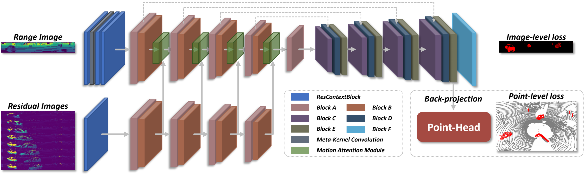

# Efficient Spatial-Temporal Information Fusion for LiDAR-Based 3D Moving Object Segmentation
This repo contains the code for our paper: 

> Efficient Spatial-Temporal Information Fusion for LiDAR-Based 3D Moving Object Segmentation.  
> [Jiadai Sun](https://github.com/MaxChanger), [Yuchao Dai](https://scholar.google.com/citations?user=fddAbqsAAAAJ&hl=en&oi=ao), [Xianjing Zhang](https://github.com/zoojing), Jintao Xu, Rui Ai, Weihao Gu, [Cyrill Stachniss](https://scholar.google.com/citations?user=8vib2lAAAAAJ&hl=en&oi=ao) and [Xieyuanli Chen](https://github.com/Chen-Xieyuanli)  
> *submitted to RAL/IROS 2022*



<br/>

## How to Use


### Installation
```bash
# Ubuntu 18.04 and above is recommended.
conda env create -f environment.yaml
conda activate mos3d

# Install SoftPool follow https://github.com/alexandrosstergiou/SoftPool
git clone https://github.com/alexandrosstergiou/SoftPool.git
cd SoftPool-master/pytorch
make install
--- (optional) ---
make test

# Install TorchSparse follow https://github.com/mit-han-lab/torchsparse
sudo apt install libsparsehash-dev 
pip install --upgrade git+https://github.com/mit-han-lab/torchsparse.git@v1.4.0

```

### Pretrained Model on KITTI-MOS
Download the [toy-dataset](https://drive.google.com/file/d/1t8OuDgFzUspWtYVHSfiGkXtGrBsuvtWL/view) and [pretrained weights](https://drive.google.com/file/d/199hRJBs-3MVgqrd4Tb08Eo5pjBG74cSX/view), and unzip them to project_path. You can also use [gdown](https://github.com/wkentaro/gdown) to download them in command line.
<details>
  <summary>[Download command for toy-dataset and checkpoints (click to expand)]</summary>
  
```bash
gdown --id 1t8OuDgFzUspWtYVHSfiGkXtGrBsuvtWL # for toy-data
unzip toydata.zip

mkdir log && cd log
gdown --id 199hRJBs-3MVgqrd4Tb08Eo5pjBG74cSX # for checkpoints
unzip ckpt_motionseg3d_pointrefine.zip

```
</details>

Then you could use the follow command to inference and visualize the predictions. If you use toy dataset, please modify the `seq_id` corresponding to valid in `data_cfg.yaml`.
```bash
# To inference the predictions.
python infer.py -d ./toydata -m ./log/motionseg3d_pointrefine -l ./pred/oursv1 -s valid
python infer.py -d ./toydata -m ./log/motionseg3d_pointrefine -l ./pred/oursv2 -s valid --pointrefine

# Visualize the predictions.
python utils/visualize_mos.py -d ./toydata -p ./pred/oursv2 --offset 0 -s 38
```
  

### Data Preperation for SemanticKITTI-MOS and KITTI-Road-MOS (newly annotated by us)
1. Download KITTI Odometry Benchmark Velodyne point clouds (80 GB) from [here](http://www.cvlibs.net/download.php?file=data_odometry_velodyne.zip).
2. Download KITTI Odometry Benchmark calibration data (1 MB) from [here](http://www.cvlibs.net/download.php?file=data_odometry_calib.zip).
3. Download SemanticKITTI label data (179 MB) (alternatively the data in Files corresponds to the same data) from [here](http://www.semantic-kitti.org/assets/dataset_odometry_labels.zip).
4. Download KITTI-Road Velodyne point clouds from [original website](http://www.cvlibs.net/datasets/kitti/raw_data.php?type=road), more details can be found in [config/kitti_road_mos.md](config/kitti_road_mos.md)
5. Download the KITTI-Road label data annotated by us from [here]().
6. Extract everything into the same folder, as follow:
<details>
  <summary>[Expected directory structure of SemanticKITTI (click to expand)]</summary>
  
```
DATAROOT
├── sequences
│   └── 08
│       ├── calib.txt                       # calibration file provided by KITTI
│       ├── poses.txt                       # ground truth poses file provided by KITTI
│       ├── velodyne                        # velodyne 64 LiDAR scans provided by KITTI
│       │   ├── 000000.bin
│       │   ├── 000001.bin
│       │   └── ...
│       ├── labels                          # ground truth labels provided by SemantiKITTI
│       │   ├── 000000.label
│       │   ├── 000001.label
│       │   └── ...
│       └── residual_images_1               # the proposed residual images
│           ├── 000000.npy
│           ├── 000001.npy
│           └── ...
```
</details>

<br/>
Next run the data preparation script to generate the residual images. More parameters about the data preparation can be found in the yaml file [config/data_preparing.yaml](config/data_preparing.yaml).

```shell
python utils/auto_gen_residual_images.py 
```

### Inference on SemanticKITTI-MOS
> The newly labeled KITTI-Road-MOS data is divided into train/valid set.  
> The useage of data can be controlled by specifying data_config.

```bash
# validation split
python infer.py -d DATAROOT -m ./log/model_path/logs/TIMESTAMP/ -l ./predictions/ -s valid # -dc config/labels/semantic-kitti-mos.yaml

# test split
python infer.py -d DATAROOT -m ./log/model_path/logs/TIMESTAMP/ -l ./predictions/ -s test # -dc config/labels/semantic-kitti-mos.raw.yaml
```
The predictions/labels will be saved to `./predictions/`. `--data_config` determines whether to use new label data KITTI-Road.


### Evaluation on SemanticKITTI-MOS validation split
```bash
# Only on seq08
python utils/evaluate_mos.py -d DATAROOT -p ./predictions/ --datacfg config/labels/semantic-kitti-mos.raw.yaml

# On seq08 + road-validation-split
python utils/evaluate_mos.py -d DATAROOT -p ./predictions/ --datacfg config/labels/semantic-kitti-mos.yaml
```


### Training on SemanticKITTI-MOS
<!-- Our program is a two-stage training process,  -->
The training is seperated into two phases, and switching between phases is currently manually controlled.

- Phase 1 (multi-gpu): Only the range image is used for input and supervision. The training log and checkpoint will be stored in `./log/ours_motionseg3d/logs/TIMESTAMP/`. 

```bash
export CUDA_VISIBLE_DEVICES=0,1,2,3
python train.py -d DATAROOT -ac ./train_yaml/mos_coarse_stage.yml -l log/ours_motionseg3d
```

- Phase 2 (single gpu): After the first phase of training, use the following command to start the second phase of training for the PointRefine module.

```bash
export CUDA_VISIBLE_DEVICES=0
python train_2stage.py -d DATAROOT -ac ./train_yaml/mos_pointrefine_stage.yml -l log/ours_motionseg3d_pointrefine -p "./log/ours_motionseg3d/logs/TIMESTAMP/"
```


## Citation

If you find this code useful for your research, please use the following BibTeX entry.

```bibtex
@article{sun2022mos3d,
  title={Efficient Spatial-Temporal Information Fusion for LiDAR-Based 3D Moving Object Segmentation},
  author={Sun, Jiadai and Dai, Yuchao and Zhang, Xianjing and Xu, Jintao and Ai, Rui and Gu, Weihao and Stachniss, Cyrill and Chen, Xieyuanli},
  year={2022}
}
```

## Acknowledgment
We would like to thank Yufei Wang and Mochu Xiang for the effective discussion.  
Some of the code in this repo is borrowed from [LMNet](https://github.com/PRBonn/LiDAR-MOS) and [spvnas](https://github.com/mit-han-lab/spvnas).

## Copyright
Copyright 2022, Jiadai Sun, Xieyuanli Chen, Xianjing Zhang, HAOMO.AI Technology Co., Ltd., China.

This project is free software made available under the GPL v3.0 License. For details see the LICENSE file.
